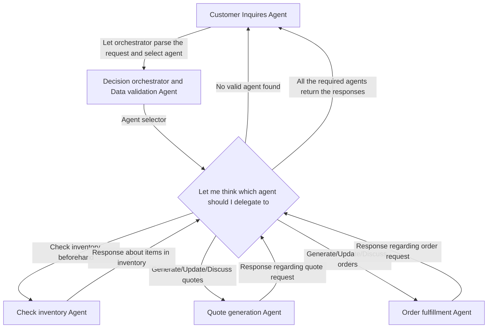

```mermaid
flowchart TD
    A[Customer Inquires Agent]
    A -->|Let orchestrator parse the request and select agent| B[Decision orchestrator and Data validation Agent]
    B -->|Agent selector| C{Let me think which agent should I delegate to}
    C -->|Check inventory beforehand| D[Check inventory Agent]
    C -->|Generate/Update/Discuss quotes| E[Quote generation Agent]
    C -->|Generate/Update/Discuss orders| F[Order fulfillment Agent]
    C -->|No valid agent found| A
    C -->|All the required agents return the responses| A
    D -->|Response about items in inventory| C
    E -->|Response regarding quote request| C
    F -->|Response regarding order request| C
```