# Beaver's Choice Multi-Agent Workflow

```mermaid
flowchart TD
    CUSTOMER([Customer request])

    subgraph AIADAPTER["Pydantic AI Adapter - replaceable with LangChain"]
        CA["1. Customer Inquiry Agent<br/>Customer-facing response"]
        OA["2. Decision Orchestrator Agent<br/>Extracts route, dates, quantities,<br/>and raw product phrases"]
        IA["3. Inventory Agent<br/>Explains inventory result"]
        QA["4. Quote Agent<br/>Explains pricing result"]
        SA["5. Order Fulfillment Agent<br/>Explains fulfillment result"]

        IT["inventory_lookup_tool<br/>Purpose: expose authoritative<br/>inventory service result"]
        QT["quote_calculation_tool<br/>Purpose: expose authoritative<br/>quote service result"]
        OT["order_fulfillment_tool<br/>Purpose: expose authoritative<br/>order service result"]
    end

    subgraph APP["Application Layer"]
        WF["WorkflowOrchestrator<br/>Coordinates ports, services,<br/>and response safety"]
        ER["EvaluationRunner<br/>Runs quote_requests_sample.csv<br/>and writes test_results.csv"]
    end

    subgraph DOMAIN["Domain Core - framework independent"]
        CM["CatalogMatchingService<br/>Exact aliases, fuzzy threshold,<br/>unsupported-item decisions"]
        INV["InventoryService<br/>Stock, safety stock,<br/>restock and deadline rules"]
        QUO["QuoteService<br/>Discounts, totals,<br/>historical quote context"]
        ORD["OrderFulfillmentService<br/>Feasibility, atomic order rules,<br/>post-order financial state"]
        SAFE["ResponseSafetyService<br/>Blocks internal data and<br/>bad fulfilled/rejected wording"]
    end

    subgraph PORTS["Ports - Protocol interfaces"]
        AIP["InquiryPlanner / SpecialistReporter / CustomerResponder"]
        RP["InventoryRepository<br/>TransactionRepository<br/>FinancialReportRepository<br/>QuoteHistoryRepository"]
        TP["TelemetryPort"]
        OP["EvaluationOutputPort"]
        IP["IdGeneratorPort / ClockPort"]
    end

    subgraph INFRA["Infrastructure Adapters"]
        SQL["SqlAlchemyPersistenceAdapter<br/>SQLite now; PostgreSQL-compatible URL later"]
        LOG["LogfireTelemetryAdapter"]
        CSV["CsvEvaluationOutputAdapter"]
        IDS["UuidGeneratorAdapter<br/>SystemClockAdapter"]
    end

    subgraph HELPERS["Reviewer Compatibility Helpers"]
        H1["get_all_inventory(as_of_date)"]
        H2["get_stock_level(item_name, as_of_date)"]
        H3["get_supplier_delivery_date(date, quantity)"]
        H4["search_quote_history(search_terms)"]
        H5["get_cash_balance(as_of_date)"]
        H6["create_transaction(...)"]
        H7["generate_financial_report(as_of_date)"]
    end

    CUSTOMER -->|"Text inquiry"| WF
    WF -->|"Plan request"| AIP
    AIP --> OA
    OA -->|"ExtractedInquiry:<br/>raw item phrases"| WF
    WF -->|"Raw items"| CM
    CM -->|"Normalized InquiryPlan<br/>exact catalog names + unmatched items"| WF

    WF -->|"Inventory task"| INV
    INV --> RP
    RP --> SQL
    INV -->|"InventoryResult"| IA
    IA --> IT
    IT --> IA
    IA -->|"Inventory report"| WF

    WF -->|"Quote task"| QUO
    QUO --> RP
    QUO -->|"QuoteResult"| QA
    QA --> QT
    QT --> QA
    QA -->|"Quote report"| WF

    WF -->|"Order task"| ORD
    ORD --> RP
    ORD --> IP
    ORD -->|"OrderResult"| SA
    SA --> OT
    OT --> SA
    SA -->|"Order report"| WF

    WF --> SAFE
    WF --> TP
    WF -->|"Final facts"| CA
    CA -->|"Customer-safe response"| WF
    WF --> CUSTOMER

    ER --> WF
    ER --> OP
    OP --> CSV
    TP --> LOG
    IP --> IDS

    H1 --> SQL
    H2 --> SQL
    H3 --> INV
    H4 --> SQL
    H5 --> SQL
    H6 --> SQL
    H7 --> SQL

    classDef agent fill:#dbeafe,stroke:#1d4ed8,stroke-width:2px,color:#172554;
    classDef tool fill:#dcfce7,stroke:#15803d,stroke-width:2px,color:#052e16;
    classDef domain fill:#ede9fe,stroke:#7c3aed,stroke-width:2px,color:#2e1065;
    classDef port fill:#fae8ff,stroke:#a21caf,stroke-width:2px,color:#4a044e;
    classDef adapter fill:#fef3c7,stroke:#b45309,stroke-width:2px,color:#451a03;
    classDef external fill:#f3f4f6,stroke:#4b5563,stroke-width:2px,color:#111827;

    class CA,OA,IA,QA,SA agent;
    class IT,QT,OT tool;
    class CM,INV,QUO,ORD,SAFE,WF,ER domain;
    class AIP,RP,TP,OP,IP port;
    class SQL,LOG,CSV,IDS,H1,H2,H3,H4,H5,H6,H7 adapter;
    class CUSTOMER external;
```

## Responsibility And Tool Map

| Layer | Responsibility | Replaceable boundary |
|---|---|---|
| Pydantic AI Adapter | Hosts the five project agents and the three worker tools | Can be replaced by LangChain or another agent framework through AI ports |
| Application Layer | Coordinates planning, deterministic catalog matching, domain services, telemetry, evaluation, and response safety | Keeps workflow orchestration out of the domain |
| Domain Core | Owns catalog matching, inventory, quoting, fulfillment, discounts, lead times, and customer-response safety rules | Imports no Pydantic AI, SQLAlchemy, Pandas, Logfire, env vars, or filesystem paths |
| Ports | Defines Protocol interfaces for AI, repositories, telemetry, output, IDs, and clock | Stable contracts used by application/domain services |
| Infrastructure Adapters | Implements ports with SQLAlchemy/SQLite, Logfire, CSV/Pandas, UUIDs, and system clock | SQLite can become PostgreSQL or another store by replacing the persistence adapter |

## Agent And Tool Details

| Agent | Responsibility | Pydantic AI tool | Authoritative domain service |
|---|---|---|---|
| Customer Inquiry Agent | Produces the final customer-safe response | No direct business mutation tool | `ResponseSafetyService` validates output |
| Decision Orchestrator Agent | Extracts route, dates, quantities, and raw product phrases | No mutation tool | `CatalogMatchingService` normalizes items after extraction |
| Inventory Agent | Explains stock, restocking, and deadline feasibility | `inventory_lookup_tool` | `InventoryService` |
| Quote Agent | Explains prices, discounts, and historical context | `quote_calculation_tool` | `QuoteService` |
| Order Fulfillment Agent | Explains fulfillment or rejection | `order_fulfillment_tool` | `OrderFulfillmentService` |

The orchestrator can still call more than one specialist for an order. The
critical difference is that worker tools now expose already-computed domain
service results; business rules and writes live in the framework-independent
domain core and persistence ports, not inside Pydantic AI agent code.
